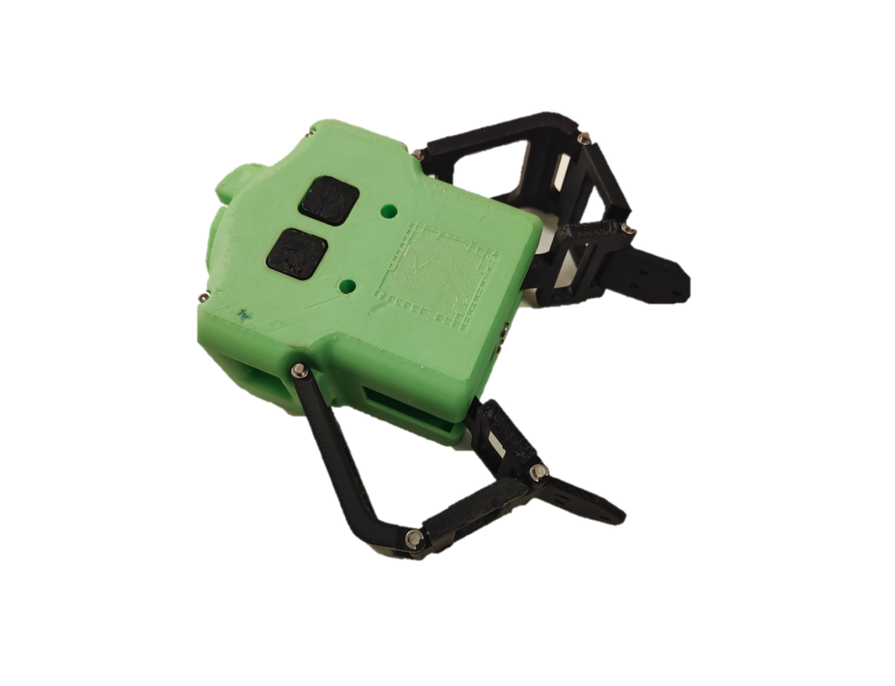
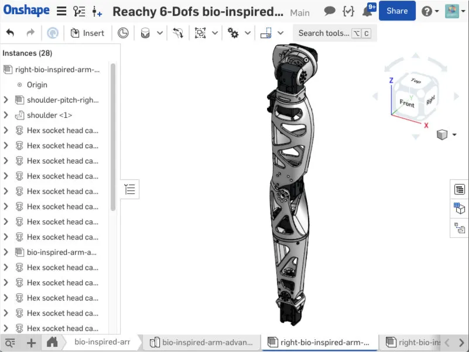
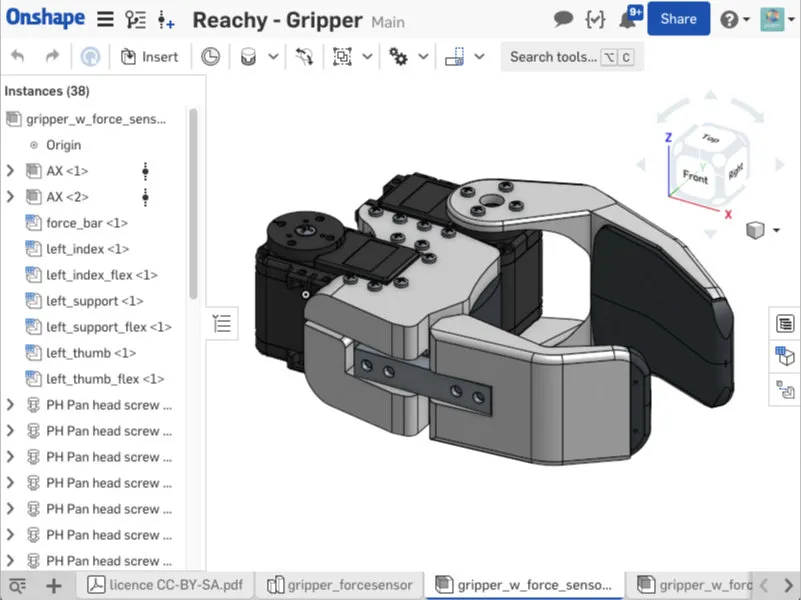
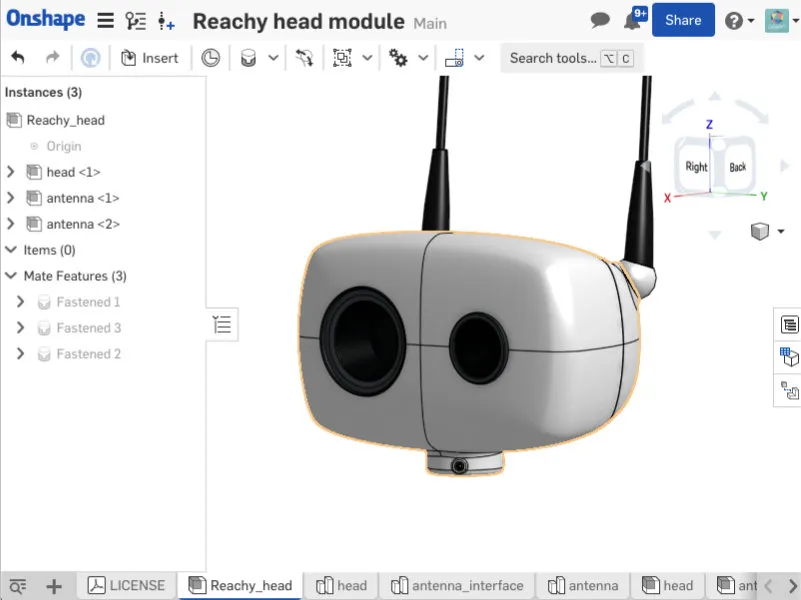
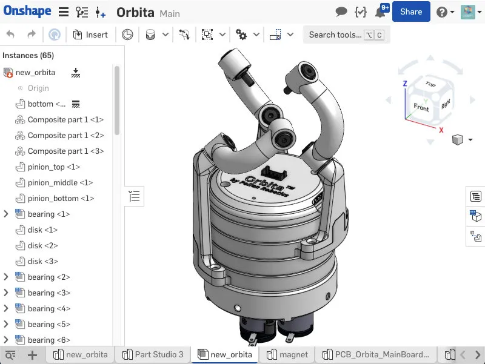

* (10%) Attendance — recorded randomly during classes by Teaching Assistants.
* (20%) Assignment.
* (20%) Fusion 360 certificates — four certificates, each worth 5%.
* (20%) Team Final Poster — design of a Reachy part.
* (10%) Team 3D Print — generative design of a Reachy part.
* (20%) Team Final Poster — Reachy applications for social good.

### Project Deliverables — 70%

Submit a Fusion 360 certificate every two weeks. For the Reachy-part poster, explain the design and working principles, provide a step-by-step assembly, and justify how generative design improves a selected part using the four Fusion 360 courses. Refine the design and 3D-print a physical model for testing through assembly with the full-size robot. For the application poster, propose intelligence for Reachy Fusion that serves social good.

Form a project team of four to five students and explain each member's design tasks. The final presentation covers the team's design analysis, assembly, generative design and proposed application.

The archived schedule and project brief give different assignment cutoff times; both are recorded under Important Deadlines.

### Project Reachy Fusion

Use [Reachy by Pollen Robotics](https://www.pollen-robotics.com/) to practice mechanical design using Autodesk Fusion 360. Analyze Reachy's engineering characteristics and performance, document the design and assembly process, and propose design improvements and applications for social good.

### Team Parts and Design Roles

Seven teams cover the head (4 designers), neck/Orbita joint (4), trunk (4), left arm (5), left gripper (4), right arm (5) and right gripper (5). The right arm and gripper use prototypes developed by Sun Haoran, with the task of improving their fit to Reachy.

Suggested roles cover technical drawings, step-by-step assembly instructions, mechanical analysis and engineering specifications, and the overall instruction manual. These roles are guidance, not requirements; students may contribute across roles and more than one student may share a role.

### Workshop Preparation

* Week 09: identify engineering drawings, parts and fasteners; review assembly and joint types; organize engineering specifications; gather documentation for the manual.
* Week 10: clarify roles, tasks and deliverables; review problems with teammates and teaching staff; assess the official Reachy documentation; agree an action plan with individual deadlines.
* Weeks 11–14: prepare the poster and use the 3D-printing service.
* Week 15: submit the Reachy design poster by Monday Dec 26, 2330.
* Week 16: present the project to the Course Instructor and guest professionals.

Poster guidance: [Harvard](https://it.hms.harvard.edu/our-services/research-computing/services/research-imaging-solutions/ris-seminar-handouts), [MIT](https://mitcommlab.mit.edu/nse/commkit/poster/), [NYU](https://guides.nyu.edu/posters).

### Reachy Design Resources

[Head](https://cad.onshape.com/documents/5a9e7c88f6e1068df540bf7a/), [neck/Orbita joint](https://cad.onshape.com/documents/5ca7f684d33fbcace89ad4d3/), [trunk](https://cad.onshape.com/documents/0306aa0a644dba7cf10899a8/), [arm](https://cad.onshape.com/documents/2cd541150588bd17e3473399/) and [gripper](https://cad.onshape.com/documents/4456e4d7aa9833296dc141b2/).

The head combines antenna actuation and vision sensors. The neck uses a compact parallel mechanism driven by three brushless motors. The trunk supports the moving parts and electronics. Arm and gripper design focuses on range of motion, dexterity and physical interaction.

The following Reachy images are reproduced from the original course's educational materials, which credit Pollen Robotics. Contact: [wanf@sustech.edu.cn](mailto:wanf@sustech.edu.cn).

### Fusion 360 Learning Resources

* [Fusion 360 Basics](https://www.autodesk.com/certification/learn/course/fusion360-intro-to-3d-modeling-associate)
* [Simulation and Static Stress Analysis](https://www.autodesk.com/certification/learn/course/fusion360-simulation-applications-for-static-stress-analysis-professional)
* [Introduction to Generative Design](https://www.autodesk.com/certification/learn/course/fusion360-generative-design-intro-expert)
* [Generative Design for Manufacturing](https://www.autodesk.com/certification/learn/course/fusion360-generative-design-manufacturing-applications-expert)
