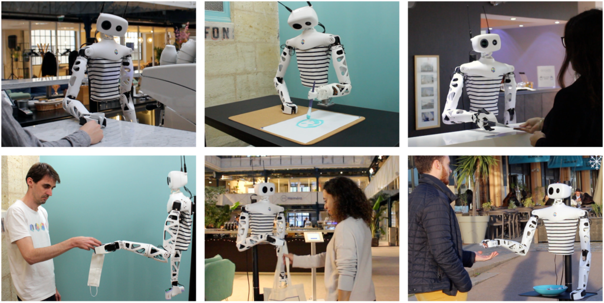

# DES5002 Designing Robots for Social Good

## Course Description



## Learning Outcomes

At the end of this course, students will be able to:

1. Conduct analysis of robotic systems in terms of technical and ethical aspects.
2. Adopt advanced technologies in designing robotic systems.
3. Demonstrate ability to align technical and ethical guidelines in designing robots for social good.

## Content Summary



## Course Instructor & Teaching Team



## Grading Policy



## Academic Integrity



## University Calendar



## Recommended Textbook(s)



## Teaching Schedule



## Important Deadlines



## Project Reachy Fusion for DES5002

In this project, we aim to adopt [Reachy by Pollen Robotics](https://www.pollen-robotics.com/) as the subject to practice basic concepts in mechanical design using Autodesk Fusion 360. The overall goal is to conduct a design analysis of Reachy to evaluate its engineering characteristics against its performance, use Fusion 360 as the tool for design analysis, formulate a user manual with details instructions and conclude with design recommendations for future iterations.

\[All images and videos below are reproduced from Reachy main website for educational purposes only. We hope to talk with Reachy about properly using this media content. Please contact [wanf@sustech.edu.cn](mailto:wanf@sustech.edu.cn) for more.]

<figure><figcaption></figcaption></figure>

Seven teams of design engineers are to be formulated, covering each part of Reachy, including

<table><thead><tr><th></th><th data-hidden data-type="image">Cover image</th></tr></thead><tbody><tr><td>

<a href="https://cad.onshape.com/documents/5a9e7c88f6e1068df540bf7a/">Head</a> (4 designers)
<ul><li>This is a relatively simple design compared to the rest of Reachy, with only two servo motors moving the antenna. It also has two vision sensors with two lenses of the same specs but different shapes from the outlook.</li></ul></td><td><a href=".gitbook/assets/onshape_head_module.webp">onshape_head_module.webp</a></td></tr><tr><td>

<a href="https://cad.onshape.com/documents/5ca7f684d33fbcace89ad4d3/">Neck/Orbita Joint</a> (4 designers)
<ul><li>This is a relatively complex design compared to the rest of Reachy, where a patented parallel mechanism is driven by three brushless motors designed in a compact form factor. It looks a bit strange but functions in a “magical” way, powered by kinematics.</li></ul></td><td><a href=".gitbook/assets/onshape_orbita.webp">onshape_orbita.webp</a></td></tr><tr><td>

<a href="https://cad.onshape.com/documents/0306aa0a644dba7cf10899a8/">Trunk</a> (4 designers)
<ul><li>This is the largest part of Reachy with no moving parts, but all movable parts will be connected. It houses most electronics and needs sufficient engineering rigidity, where structural analysis would be required.</li></ul></td><td><a href=".gitbook/assets/onshape_trunk_module.webp">onshape_trunk_module.webp</a></td></tr><tr><td>

Left <a href="https://cad.onshape.com/documents/2cd541150588bd17e3473399/">Arm</a> (5 designers)
<ul><li>This is the most dexterous part of Reachy with the most degree of freedom, providing planning for physical interaction with the external environment. It houses most of the servo motors of Reachy with a large range of motion that needs to be carefully characterized and designed.</li></ul></td><td><a href=".gitbook/assets/onshape_arm_module.webp">onshape_arm_module.webp</a></td></tr><tr><td>

Left <a href="https://cad.onshape.com/documents/4456e4d7aa9833296dc141b2/">Gripper</a> (4 designers)
<ul><li>This is the part where the dream (or simulation) comes true to affect the actual interaction with the physical environment. The challenge is to involve the least number of servo motors for maximum dexterity while dealing with the objects of various designs.</li></ul></td><td><a href=".gitbook/assets/onshape_gripper_module.webp">onshape_gripper_module.webp</a></td></tr><tr><td>

Right <a href="https://cad.onshape.com/documents/2cd541150588bd17e3473399/">Arm</a> (5 designers)
<ul><li>In this project, your team will use an Arm prototype developed by Sun Haoran (SUSTech Mechanical Class 2016, currently a SUSTech-HKU Joint Ph.D. student at SUSTech Design and Learning Lab). We will provide a working prototype, and your task will involve providing further design optimization so that it may fit Reachy in a better way. Talk to the course instructor for further details.</li></ul></td><td><a href=".gitbook/assets/Screen-Shot-2022-08-30-at-11.35.11-1024x786.webp">Screen-Shot-2022-08-30-at-11.35.11-1024x786.webp</a></td></tr><tr><td>

Right <a href="https://cad.onshape.com/documents/4456e4d7aa9833296dc141b2/">Gripper</a> (5 designers)
<ul><li>In this project, your team will use a Gripper prototype developed by Sun Haoran (SUSTech Mechanical Class 2016, currently a SUSTech-HKU Joint Ph.D. student at SUSTech Design and Learning Lab). We will provide a working prototype, and your task will involve providing further design optimization so that it may fit Reachy in a better way. Talk to the course instructor for further details.</li></ul></td><td><a href=".gitbook/assets/Screen-Shot-2022-08-30-at-11.35.47-1024x786.webp">Screen-Shot-2022-08-30-at-11.35.47-1024x786.webp</a></td></tr><tr><td></td><td></td></tr></tbody></table>

<table data-view="cards"><thead><tr><th></th><th data-hidden data-card-cover data-type="image">Cover image</th></tr></thead><tbody><tr><td></td><td><a href=".gitbook/assets/reachy-arm-kit.webp">reachy-arm-kit.webp</a></td></tr><tr><td></td><td><a href=".gitbook/assets/reachy-expressive-kit.webp">reachy-expressive-kit.webp</a></td></tr><tr><td></td><td><a href=".gitbook/assets/reachy-advanced-kit.webp">reachy-advanced-kit.webp</a></td></tr></tbody></table>

### Roles of Design Engineers

Each team will focus on your allocated part of Reachy, with different roles of design engineers covering the following areas. When formulating your team, be sure to identify your role from the beginning.

* Design engineer 1 for producing technical drawings for each component
  * You should be generally proficient with CAD software and be open to training yourself fluently using Fusion 360. You are highly encouraged to review the recommended training videos to familiarize yourself with Fusion 360 and its usage. You should generally have an open mind or experience in manufacturing, fabrication, or prototyping. It would be great if you have already, or plan to have, experience dealing with various vendors or suppliers. Your attention to detail is most valued as a design engineer in general and regarding your contribution to the project.
* Design engineer 2 for arranging the step-by-step assembly instruction
  * You should be generally proficient with CAD software and be open to training yourself fluently using Fusion 360. You are highly encouraged to review the recommended training videos to familiarize yourself with Fusion 360 and its usage. You should feel good about visualizing designs or decomposing machines within your mind and put your skills into practice. Your logical thinking is most valued as a design engineer in general and regarding your contribution to the project.
* Design engineer 3 for analyzing the mechanical components for engineering specs
  * You should be comfortable working with modeling and numbers. Besides the recommended training videos, you are encouraged to familiarize yourself with engineering specs of things, structures, components, and designs. You should be a highly organized engineer that can put things into numbers and calculations to justify the reasoning behind a design and be generally familiar with things other than mechanical, such as electronics, materials, mechanics, control, programming, etc. Your calculations and logic play a critical role in explaining the engineering details of the design.
* Design engineer 4 for preparing the overall instruction manual
  * You should be comfortable with communication, expression, and writing. Besides the recommended training videos, you are encouraged to organize communication within your team and translate design analysis into structured logic that better explains the engineering details behind a particular design. You should be the one constantly asking the questions and organize your team’s answer into a logical expression that answers the “why” behind a design. Your overview of the big picture plays a critical role in explaining the engineering details of the design.

Notes on roles and teams

* **The above description only serves as a guide to help you better position your role within the team. NOT REQUIRED.**
* **The role description does not restrict your involvement in the team project, and there may be more than one student per role.**
* [**Express your interest in Team Formation here.**](https://ancorasir.com/?page_id=3262)

### About Reachy by Pollen Robotics

Reachy is an expressive open-source humanoid platform programmable with Python and ROS. He is particularly good at interacting with people and manipulating objects.

Starting this year, we adopt Reachy in our teaching and learning for students at SUSTech Design and Learning Lab, with pilot projects through ME303 Mechanical Design, DES5002 Designing Robots for Social Good, and hopefully more. The shared idea is to implement Reachy as the subject of learning the various mechanical and robot design features. Both courses will share a similar structure to rebuild the Reachy with a touch of Fusion 360, as the original project was implemented using OnShape.

* For [DES5002](https://des5002.ancorasir.com/), as a selective course for graduate students, the aim is to practice the use of modern CAD systems (Fusion 360 in our case) to get yourself familiar with some of the key concepts behind the design of various standard and non-standard parts as well as the whole assembly process, using the Generative Design tool to recreate new designs by defining the engineering constraints, 3D print and assemble a new design of Reachy assembled for potential applications in Social Good.

### About Fusion 360 by Autodesk

[Fusion 360 is a cloud-based 3D modeling, CAD, CAM, CAE, and PCB software platform for professional product design and manufacturing.](https://www.autodesk.com/products/fusion-360/overview?term=1-YEAR\&tab=subscription)

With SUSTech School of Design, we have partnered with Autodesk to establish an Autodesk Training Center at SUSTech. A training lab with top-end Mac computers is provided by the School of Design so that our students can use and practice the use of Fusion 360 for the course. Meanwhile, through Autodesk Training Center, we offer technical and financial support for students who are willing to take the certification to become licensed practitioners of Fusion 360 in their future careers.

### Workshop Notes

#### Week 01\~08: Please refer to the table above for further instructions.

#### Week 09: Individual Design Review for Reachy Fusion

* Each team will be provided with a Fusion 360 folder to work with your Reachy Design. By the end of the semester, we will assemble everything into a whole design, with an overall structure as below.
  * Reachy Fusion
    * Trunk (fixed)
      * Neck
        * Head
      * Left Arm
        * Left Gripper
      * Right Arm
        * Right Gripper
* For your team’s part of Reachy,
  * Design Engineer 1: Have you identified the files and templates for producing the engineering drawings? How many parts? Bolts and nuts?
  * Design Engineer 2: Have you reviewed the assembly process step-by-step? Did you propose a sub-assembly for your design? Joint Types?
  * Design Engineer 3: Have you identified the engineering specs? Have you made a list of the spec, organized logically with technical data?
  * Design Engineer 4: Have you found all the necessary information to explain the design? Have you reviewed the templated for the manual report?

#### Week 10: Team Design Review for Reachy Fusion

* Based on the project introduction since the semester started and the instructions since Week 09, discuss and share with your team what you have found.
* Have each team member clarified your project’s role, task, and deliverables?
  * What remains a problem?
  * Have you talked with your team to resolve it? Have you talked with the Teaching Assistants? Do you need help from the Course Instructor?
  * Have your team reviewed the official documentation from the Reachy website and identified the positive and negative sides of the documentation?
  * Do you see a challenge you or your team may not resolve by submitting the final report?
  * What do you see would be the challenge to influence negatively to your final manual report’s quality?
* Have your team worked out an action plan to move on to the next week, with deliverables and timelines identified for each team member?

#### Week 11\~14: Poster Preparation and 3D Printing Service

* Tips on poster preparation
  * [Harvard](https://it.hms.harvard.edu/our-services/research-computing/services/research-imaging-solutions/ris-seminar-handouts)
  * [MIT](https://mitcommlab.mit.edu/nse/commkit/poster/)
  * [NYU](https://guides.nyu.edu/posters)

#### Week 15: Reachy Fusion Poster by Sunday Midnight

* Project Assignment: Submit your team’s Reachy Design Poster by Monday, Dec 26 @ 23:30.

#### Week 16: Final Presentation

* Final presentation by each team and project review by the Course Instructor and Guest Professionals.
