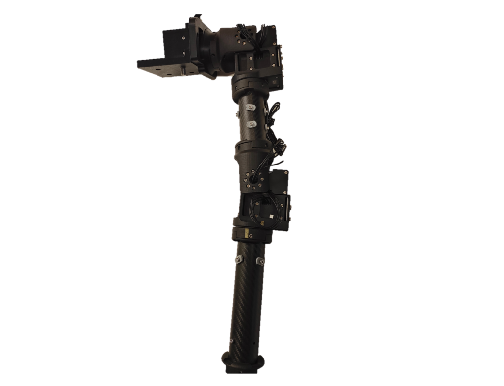
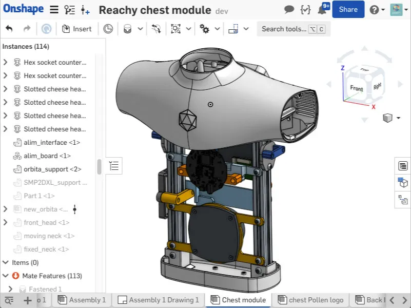
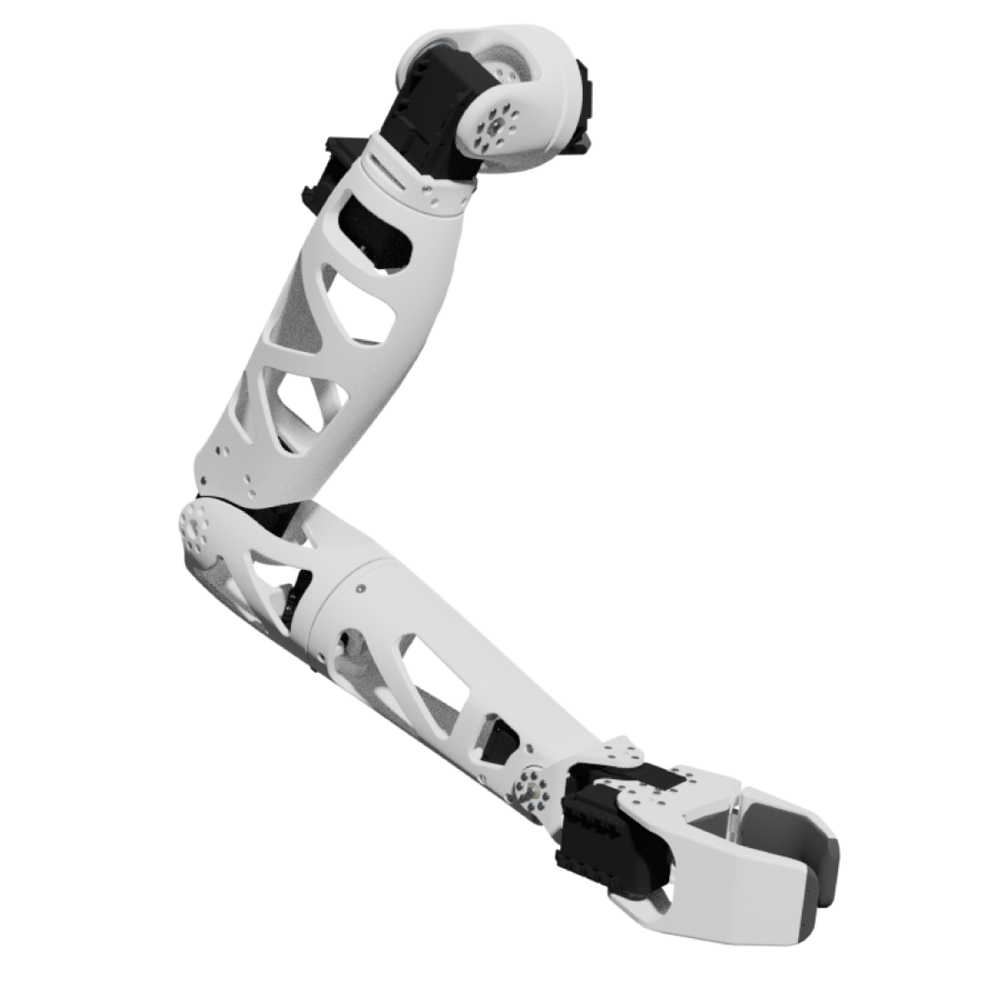

* (10%) Attendance — recorded during each class by Teaching Assistants.
* (20%) Assignment.
* (20%) Team Poster 1 — design of a humanoid robot, focusing on hardware.
* (50%) Team Final Poster — design of humanoid applications for social good.

### Team Project — 70%

Form a team of three students. Explain the design process and working principles of your humanoid robot. A step-by-step assembly and 3D models are optional. Propose an application using robotics and LLMs for social good, focusing on the user, scenario and interaction. Present your team's design tasks, robot design and proposed application at the final review.

The archived schedule and project brief contain different assignment deadlines; both are recorded under Important Deadlines.

### Project Reachy Fusion

Use [Reachy by Pollen Robotics](https://www.pollen-robotics.com/) to practice mechanical design using Autodesk Fusion 360. Analyze Reachy's engineering characteristics and performance, document the design and assembly process, and propose design improvements and applications for social good.

### Reachy Design Resources

[Head](https://cad.onshape.com/documents/5a9e7c88f6e1068df540bf7a/), [neck/Orbita joint](https://cad.onshape.com/documents/5ca7f684d33fbcace89ad4d3/), [trunk](https://cad.onshape.com/documents/0306aa0a644dba7cf10899a8/), [arm](https://cad.onshape.com/documents/2cd541150588bd17e3473399/) and [gripper](https://cad.onshape.com/documents/4456e4d7aa9833296dc141b2/).

The head combines antenna actuation and vision sensors. The neck uses a compact parallel mechanism driven by three brushless motors. The trunk supports the moving parts and electronics. Arm and gripper design focuses on range of motion, dexterity and physical interaction.

The following Reachy images are reproduced from the original course's educational materials, which credit Pollen Robotics. Contact: [wanf@sustech.edu.cn](mailto:wanf@sustech.edu.cn).

